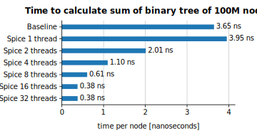
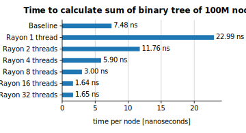
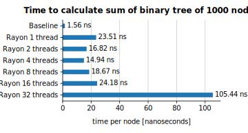

# Benchmark of Spice and Rayon

Date: August 2024.

## Introduction

[Rayon][rayon] is high-quality data-parallelism library written in Rust based on the well-known technique of _work-stealing fork/join_.
[Spice](..), written in Zig, is an experimental implementation of _heartbeat scheduling_ which claims to have a much smaller overhead.
We'd like to understand how these two techniques compares against each other.

Evaluations of parallel frameworks are often summarized along the lines of "we implemented X algorithms, ran it on a machine with 48 cores and saw a (geometric) mean improvement of 34x".
This is a fine way of validating that it works for a wide range of problems, but it's hard to draw conclusions from the final result.
It's also not very interesting for a comparison between Spice and Rayon because they are widely different (experimental vs production-ready; Zig vs Rust).

This benchmark therefore rather focuses on a _single_ simple problem and tries to maximize its learning from a small set of focused experiments.
Further benchmarks are recommended to validate the findings.

## Key findings and recommendations

- Rayon adds roughly **15 nanoseconds** overhead for a single invocation of `fork/join`.
  This means the smallest amount of work should take around **~1 microsecond** for the overhead be negligible (<1%).
- Rayon shows **good linear scalability**: ~14x performance improvement when going from 1 to 16 threads.
  This was when the total duration of the program was in the scale of **seconds**.
- Rayon struggled a lot when the overall duration was on the scale of **microseconds**.
  At 16 threads we saw _worse_ performance than using only 1.
  In this scenario, using more threads (32) than cores (16) was **detrimental** to the performance (~60x slowdown).
- Spice has sub-nanosecond overhead for a single invocation of `fork/join`.
  This means the smallest amount of work should take around **tens of nanoseconds** for the overhead be negligible (<1%).
- Spice shows **subpar scalability**:
  The speed-up of using 16 threads was merely ~11x (compared to Rayon's ~14x).

## Methodology

There's three areas we'd like to focus on:

- **Understand the fixed overhead:**
  We expect there to be a overhead of writing a program in a parallel-enabled style compared to a baseline implementation.
  This overhead is most likely _constant_: Every instance of possible parallelism now takes a few extra nanoseconds.
  To determine this overhead we can compare a baseline implementation with a parallel-enabled implementation which only uses a single thread.
- **Understand scalability:**
  Ignoring the overhead, we'd like the program to be twice as fast when given twice amount of threads.
- **Understanding contention and synchronization:**
  Multiple threads can interact with each other in ways that are hard to predict.

In order to explore these areas we've therefore decided to focus on _summing the values of a perfectly balanced binary tree_.

<details>
<summary>Baseline Zig implementation</summary>

```zig
const Node = struct {
    val: i64,
    left: ?*Node = null,
    right: ?*Node = null,

    fn sum(self: *const Node) i64 {
        var res = self.val;
        if (self.left) |child| res += child.sum();
        if (self.right) |child| res += child.sum();
        return res;
    }
};

fn balancedTree(allocator: std.mem.Allocator, from: i64, to: i64) !*Node {
    var node = try allocator.create(Node);
    node.* = .{ .val = from + @divTrunc(to - from, 2) };
    if (node.val > from) {
        node.left = try balancedTree(allocator, from, node.val - 1);
    }
    if (node.val < to) {
        node.right = try balancedTree(allocator, node.val + 1, to);
    }
    return node;
}
```

</details>

<details>
<summary>Baseline Rust implementation</summary>

```rust
struct Node<T> {
    value: T,
    left: Option<Box<Node<T>>>,
    right: Option<Box<Node<T>>>,
}

fn sum(node: &Node<i64>) -> i64 {
    let mut result = node.value;
    if let Some(child) = &node.left {
        result += sum(child);
    }
    if let Some(child) = &node.right {
        result += sum(child);
    }
    return result;
}

fn make_balanced_tree(from: i64, to: i64) -> Node<i64> {
    let value = from + (to-from)/2;
    return Node {
        value: value,
        left: (value > from).then(|| Box::new(make_balanced_tree(from, value - 1))),
        right: (value < to).then(|| Box::new(make_balanced_tree(value + 1, to))),
    };
}
```

</details>

This is a program which is very small and easy to reason about.
The actual unit of work is minimal which means that any overhead is easily observable.
This program is not representative of real-world use cases, but it will give us valuable insights nonetheless:

- The structure of the tree is _optimal_ for parallelism.
  If we're not able to speed up a _perfectly_ balanced problem, why would it be any good at a messy real-life problem?
- Running the baseline and comparing it with a "parallel, but locked to a single thread" should precisely tell us the overhead.
- Running with n=100 million nodes will represent a quite decent chunk of work.
- Running with n=1000 nodes will highlight what happens when we have a very small amount of total work.
- Running with varying number of threads (1, 2, 4, 8, 16, 32) will

If we're seeing sub-linear scalability when increasing the number of threads there's three possible causes:

1. **Idle threads:** The scheduler is not able to precisely give threads enough work.
   These threads ends up being idle (e.g. waiting for a lock).
   This leads to higher overall latency, but leaves the system with additional resources.
   In a practical setting this isn't too bad since it's common for a system to have additional work to do.
2. **Competing threads:** The threads could be actively working and competing for the _same_ work.
   This means they are actively wasting work.
   This also leads to higher overall latency, but is much worse than the previous scenario.
3. **System limitation:** Despite being perfectly balanced, there are still shared resources in this benchmark.
   There's quite a lot of memory reads which will be.
   We're also running in the cloud where we don't have full detail over what's actually happening behind the scenes.

## Results

- Commit: `0b697d6d7af98e3db3501933c45302521b606a93`
- Command: `make bench`

These benchmarks were executed in Google Cloud (the `europe-west4` region) on a `c4-standard-16` instance which has 16 vCPUs and 60GB memory.
No other significant workloads were running at the same time, and the instance came directly from a TERMINATING state into the RUNNING state before the benchmarks were started.
The operating system is NixOS 24.05.

The numbers reported here are from a single execution of `make bench`, but during development of Spice this benchmark suite has been executed frequently and the numbers reported are consistent with earlier executions.

```
$ uname -a
Linux <hostname> 6.6.41 #1-NixOS SMP PREEMPT_DYNAMIC Thu Jul 18 11:21:27 UTC 2024 x86_64 GNU/Linux
```

### Spice

The Spice benchmarks were compiled with `ReleaseFast` and executed under a benchmark runner which does a warmup phase (3 seconds) followed by taking 50 samples.
We report the total mean scaled by number of nodes in the tree.

```
$ zig version
0.14.0-dev.564+75cf7fca9
```




### Rayon

The Rayon benchmarks were executed using [Criterion](https://docs.rs/criterion/latest/criterion/) which does a warmup phase followed by taking 50 samples.
We report the total mean scaled by number of nodes in the tree.

```
$ rustc --version
rustc 1.77.2 (25ef9e3d8 2024-04-09) (built from a source tarball)
$ cargo --version
cargo 1.77.1
```




## Discussion

**Baseline implementation:**
Both languages perform better on the small tree compared to the large tree.
This can be explained by the smaller tree being able to fit in cache.
Interestingly, the Rust implementation is _twice_ as slow as Zig's (7.48 ns vs 3.63 ns) for the large tree.
It's not obvious why this is the case.
(Another interesting anecdote: On a M3 Pro then Spice using 1 thread is actually _faster_ than the baseline implementation despite it definitely containing more instructions. This shows that it can be hard to reason about performance on the presence of caches, pipelining and branch predictions.)

**Overhead:**
Looking at the case of 100 million nodes we see that Rayon adds roughly ~15-20 ns of overhead.
Considering the overall amount of work is just ~7 ns this makes Rayon unsuitable for parallelizing this problem:
Using 4 threads were only barely faster than the baseline implementation, but wasting 4x the resources.
The minimum amount of work should rather be in the range of _microseconds_.
Spice on the other hand has a sub-nanosecond overhead and is capable of reducing the latency of ~3.3x by using 4 cores.

**Scalability:**
Rayon shows good scalability _when the tree is large enough_:
Latency is reduced by ~14x by using 16 cores.
In comparison, Spice only achieves ~11x speed-up in the same scenario.
Considering the design of Spice this is most likely caused by poor scheduling and idle threads and _not_ competing threads.

**Contention:**
For the case where we have a small tree (1000 nodes) we see that Rayon struggles a lot.
The initial overhead is similar (~19 ns), but there's no real performance gain by increasing the number of threads.
There's some _slight_ improvements going from 1 to 4 threads, but the overall latency becomes _worse_ as it increased.
At 32 threads it suddenly becomes ~60x slower than the baseline implementation.
This behavior is consistent with competing threads (i.e. retries in a lock-free queue).
Spice on the other hand shows consistent performance regardless of the number of threads.
This is due to the fact that since the overall duration is so short none of the threads actually gets scheduled any work to do.

## Future work

To explore this area further we recommend:

- **Explore the scheduling choices of Spice:**
  Spice showed subpar scalability most likely related to its scheduling mechanism.
  Further exploration into the heartbeat mechanism could possibly unlock increased scalability.
- **Increase the smallest unit of work:**
  Run a benchmark with highly CPU-bound and configurable work (i.e. SHA1 hashing repeated `x` times).
  Try with increasing the duration of the smallest unit of work and measure the overhead.
  This can validate whether our assumption that "the overhead is constant" is true or not.
- **Run a parallel-baseline version:**
  For this particular problem there is a trivial fixed way of parallelizing it:
  For e.g. 4 threads take the 4 nodes that are grand-children of the root and evaluate their sum in each thread.
  Then in the main thread wait for the result and finally sum them together with rest.
  This should have the minimal amount of overhead in terms of thread-scalability and should give an upper bound of how well this problem scales.
- **Run benchmarks with performance counters at high scale:**
  Performance counters should be able to tell whether threads are _idle_ or _competing_ as we scale.

[rayon]: https://docs.rs/rayon/latest/rayon/
